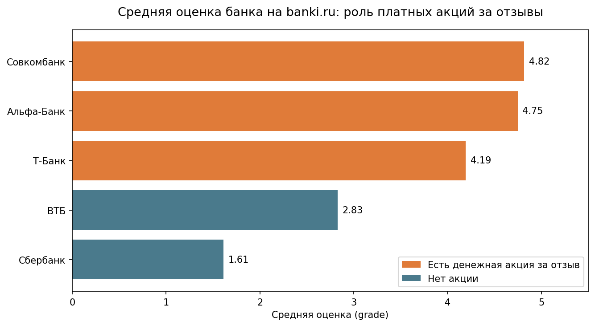

# Влияние акций с вознаграждением за отзыв на публичный рейтинг банка

Исследование на основе отзывов клиентов пяти банков (Сбербанк, ВТБ, Альфа-Банк, Т-Банк, Совкомбанк) с сайта [banki.ru](https://www.banki.ru) - сравнение банков по отзывам и проверка гипотезы о том, как денежные вознаграждения за отзыв искажают публичный рейтинг банка.

## Данные

- **Источник:** отзывы клиентов с banki.ru, все продукты для физических лиц
- **Период:** последние 12 месяцев на момент сбора данных
- **Объём:** 175 315 отзывов по 5 банкам
- **Поля:** текст и заголовок отзыва, оценка (1-5), дата, статус решения жалобы, количество комментариев

Собраны только "проверенные" отзывы.

## Главная находка: акции с вознаграждением за отзыв влияют на публичный рейтинг банка

У Альфа-Банка, Совкомбанка и Т-Банка на banki.ru действуют программы денежного вознаграждения (500-1000 ₽ или баллы) за отзыв с оценкой 4-5. У Сбербанка и ВТБ таких акций нет.

Это прямо отражается в данных: средняя оценка банков с акцией - 4.2-4.8, без акции - 1.6-2.8. Формальная проверка (chi-square, p < 0.001) подтверждает, что различия не случайны, а группировка банков по признаку "есть акция/нет акции" объясняет распределение оценок заметно лучше (Cramer's V = 0.499), чем разделение на 5 отдельных банков (Cramer's V = 0.269) - то есть именно факт наличия акции, а не индивидуальные особенности банка, является главным фактором.

Эффект оказался устойчивым даже на уровне отдельных продуктов: у банков с акцией даже объективно "проблемные" продукты (например, ипотека у Совкомбанка) получают повышенные оценки - хотя и не такие высокие, как остальные продукты того же банка.

Отдельная находка: без денежного стимула banki.ru используется в основном как канал жалоб - Сбербанк, у которого нет акции, оказался даже негативнее ВТБ, тоже без акции, что похоже на общий паттерн "доволен - промолчу, недоволен - напишу целенаправленно".

## Побочные находки

- **Ипотека**: основная причина недовольства - навязанное страхование жизни при оформлении. В январе-феврале 2026 доля жалоб на страхование в отзывах по ипотеке упала более чем вдвое (с 30% до 14%), что объясняет временный рост средней оценки в этот период
- **Реструктуризация/рефинансирование**: единственный продукт с устойчивым падением оценки в течение года у трёх из пяти банков одновременно (Альфа, Сбербанк, ВТБ) - не объясняется темой акций, возможно, связано с изменением условий рефинансирования (гипотеза не проверялась напрямую)

## Ограничения

- Выборка охватывает только "проверенные" отзывы (фильтр сайта) за конкретные 12 месяцев - не полную историю отзывов
- Метрика `resolutionIsApproved` не может использоваться как индикатор "качества решения проблем банком" - она отражает не факт решения, а то, дошёл ли клиент до финального подтверждающего решение проблемы шага

## Структура репозитория
├── 1.parsing.ipynb # сбор отзывов с banki.ru  
├── 2.Cleaning.structuring.ipynb # объединение, очистка, структурирование данных  
├── 3.EDA.ipynb # разведочный анализ: банки, продукты, динамика по месяцам, текст  
├── 4.tests.ipynb # точечные проверки находок + статистическое тестирование  
├── otziv1.png, otziv2.png # скриншоты, как выглядит страница банка с отзывами на сайте банки.ру  
└── readme_main_chart.png # финальная визуализация  

CSV-файлы не включены в репозиторий из-за объёма и получаются только при запуске 1.parsing и очистке данных в 2.Cleaning.structuring
